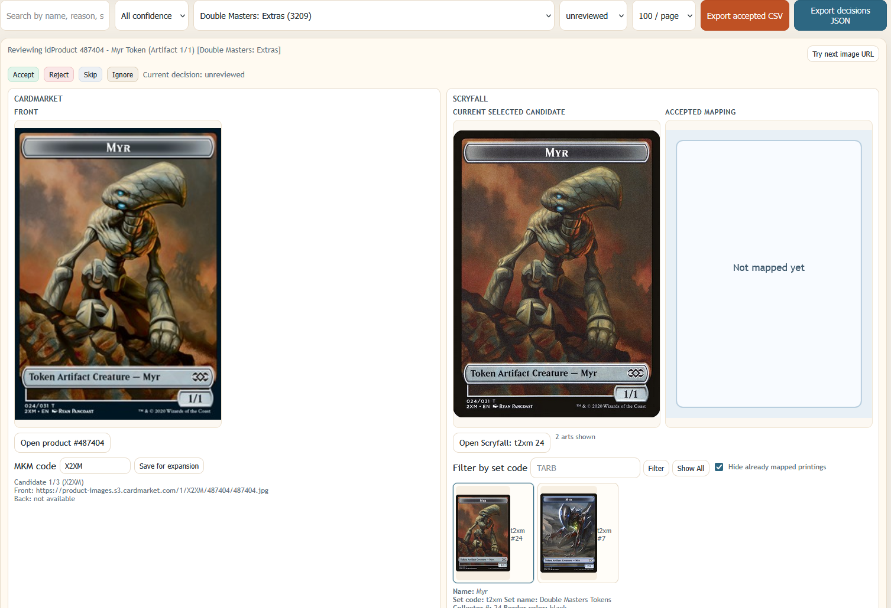

# Scryfall Missing Cardmarket IDs

This project helps review and export mappings for Magic cards where Scryfall does not yet have a `cardmarket_id`.

It combines:
- Scryfall default cards data
- Cardmarket products export
- Name/set heuristics (including promo/token/art-series handling)
- A local browser UI for manual review

## UI Preview

The review interface focuses on side-by-side printing comparison: Cardmarket images on one side, Scryfall candidates on the other, with quick accept/reject decisions and candidate filtering.



## What This Project Produces

Main generated outputs:
- `missing_cardmarket_id_mappings.csv`: proposed mappings for missing Cardmarket IDs
- `missing_cardmarket_id_summary.json`: summary stats
- `missing_cardmarket_review_by_set.md`: grouped review list
- `review_data.json`: UI data model
- `review_ui.html`: local review page

## Requirements

- Python 3.10+ (standard library is enough for these scripts)
- Input files in project root (already present in this repository):
  - `default-cards-*.json` (Scryfall default cards dump)
  - `products_singles_1.json` (Cardmarket products export)
  - `expansions.html` (Cardmarket expansion selector HTML)

Optional inputs:
- `manual_overrides.json` (manual `idProduct -> scryfall_id` overrides)
- `cardmarket_expansion_code_overrides.json` (manual expansion image code overrides)

## Quick Start

From the project directory, run:

```bash
python map_missing_cardmarket_ids.py
python build_review_ui.py
python review_server.py --host localhost --port 8000
```

Then open:

- `http://localhost:8000/review_ui.html`

## Typical Workflow

1. Generate mapping proposals.

```bash
python map_missing_cardmarket_ids.py
```

2. Build the review UI data and HTML.

```bash
python build_review_ui.py
```

3. Start the local review server.

```bash
python review_server.py --host localhost --port 8000
```

4. Review rows in the browser and mark decisions (`accepted`, `rejected`, etc.).

5. If you suspect duplicate accepted mappings, use **Review duplicate Scryfall IDs** to jump directly to conflicting accepted rows and fix them.

6. Export accepted rows via **Export accepted CSV**.

The accepted export now blocks when duplicate `scryfall_id` values are still present among accepted rows.

Current accepted export columns:
- `name,set,cn,scryfall_id,new_cardmarket_id`

## Useful Script Options

### `map_missing_cardmarket_ids.py`

Examples:

```bash
python map_missing_cardmarket_ids.py \
  --cards default-cards-20260312090730.json \
  --products products_singles_1.json \
  --output missing_cardmarket_id_mappings.csv \
  --summary missing_cardmarket_id_summary.json \
  --review-output missing_cardmarket_review_by_set.md
```

Notable flags:
- `--exclude-expansion-ids` to skip problematic expansions
- `--manual-overrides` to force known mappings

### `build_review_ui.py`

Examples:

```bash
python build_review_ui.py \
  --input missing_cardmarket_id_mappings.csv \
  --cards-json default-cards-20260312090730.json \
  --data-output review_data.json \
  --html-output review_ui.html
```

Notable flags:
- `--embed-data` to embed row data directly in HTML

### `review_server.py`

Examples:

```bash
python review_server.py --host localhost --port 8000
```

The server also proxies Cardmarket image URLs via `/mkm-image` to reduce browser-side hotlinking issues.

## Notes

- Review decisions are stored in browser `localStorage` for the page origin.
- Use the same host consistently (`localhost` vs `127.0.0.1`) to avoid "missing" decisions caused by origin mismatch.
- You can export decisions JSON from the UI as a backup.
- The compare panel includes `Previous` / `Next` navigation buttons to move between rows without changing decisions.
- `Current selected candidate` and `Accepted mapping` are intentionally separate: changing the current candidate does not change the accepted mapping until you click `Accept`/`Replace` again.

## Repository Files (Core)

- `map_missing_cardmarket_ids.py`: proposal generation and heuristics
- `build_review_ui.py`: builds `review_data.json` and `review_ui.html`
- `review_server.py`: local web server + image proxy
- `manual_overrides.json`: optional manual mapping fixes
- `cardmarket_expansion_code_overrides.json`: optional expansion image code fixes
